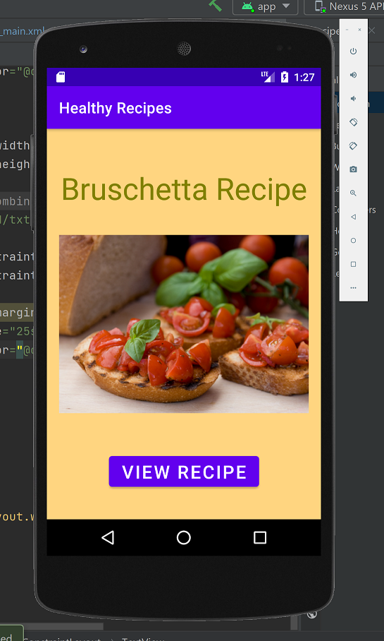
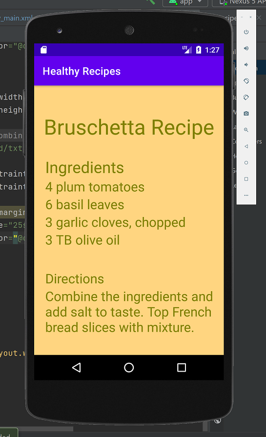
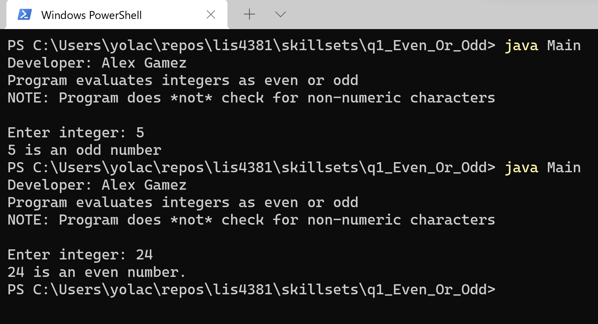
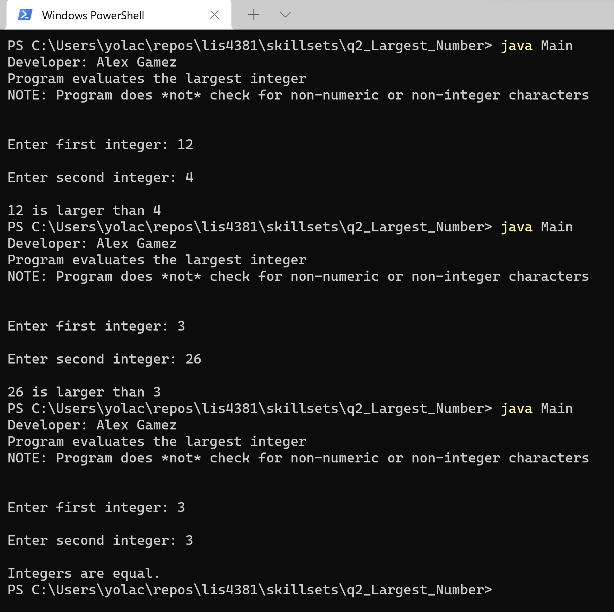
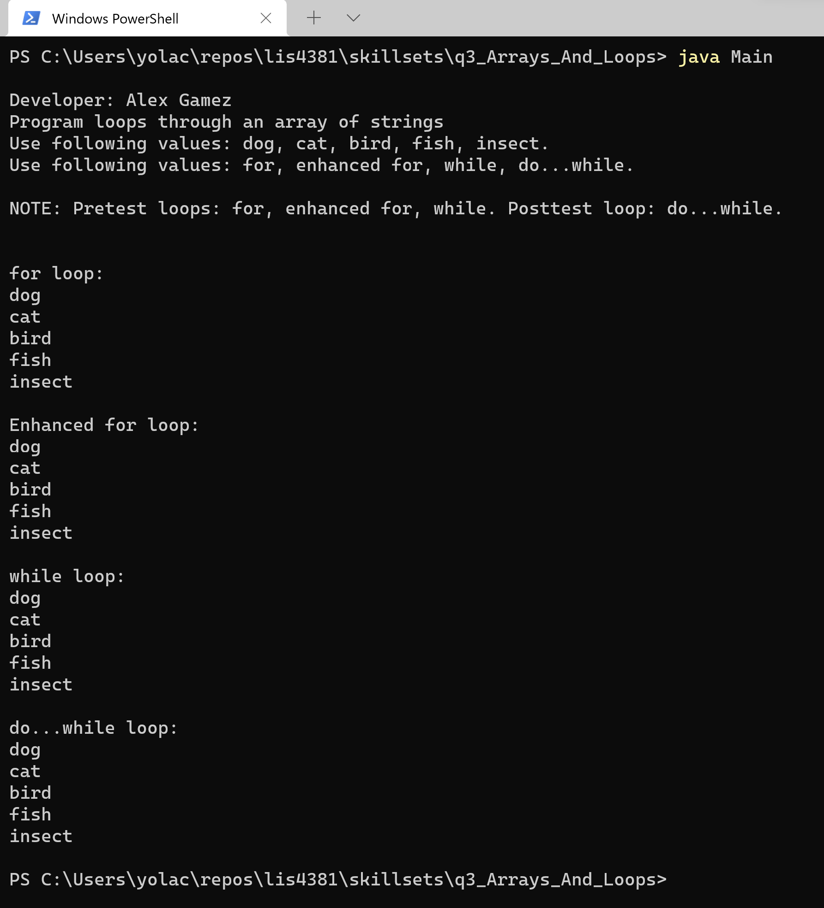

> **NOTE:** This README.md file should be placed at the **root of each of your repos directories.**
>
>Also, this file **must** use Markdown syntax, and provide project documentation as per below--otherwise, points **will** be deducted.
>

# LIS4381 - Mobile Web Application Development

## Alex Gamez

### Assignment 2 Requirements:

*Four Parts*

1. Create a mobile recipe app using Android Studio.
2. Screenshot of running application’s first user interface.
3. Screenshot of running application’s second user interface.
4. Screenshot of Skillsets 1-3.

#### Assignment Screenshots:

*Screenshot of running application's first user interface:*

{height=10 width=10}

*Screenshot of running application's second user interface:*

#### Skillset 1-3 Screenshots:

*Screenshot of Skillset 1: Even or Odd Terminal:*

*Screenshot of Skillset 2: Largest Number Terminal:*

*Screenshot of Skillset 3: Array and Loops Terminal:*

#### Deliverables

1. LIS4381 Repo: https://bitbucket.org/aeg19h/lis4381/src/master/

