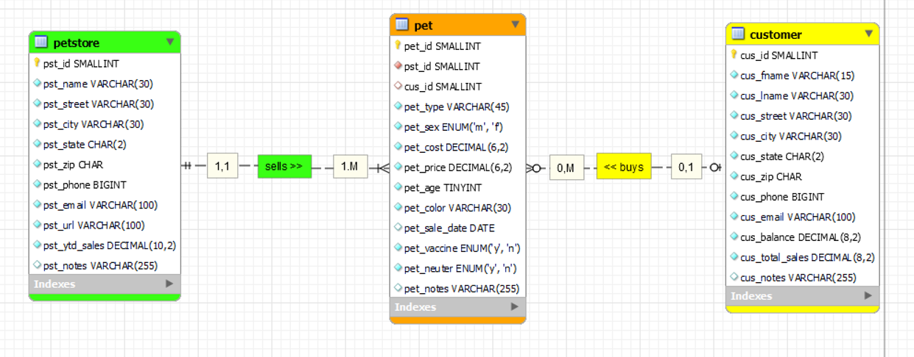
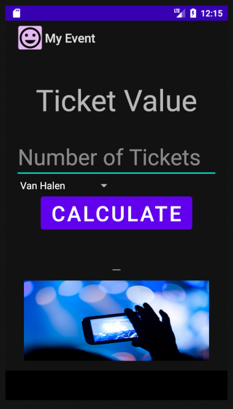
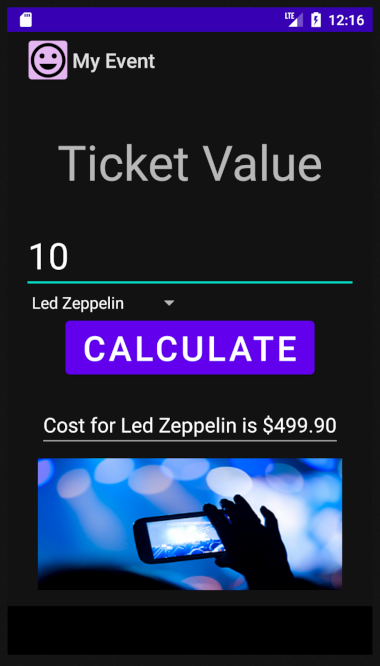
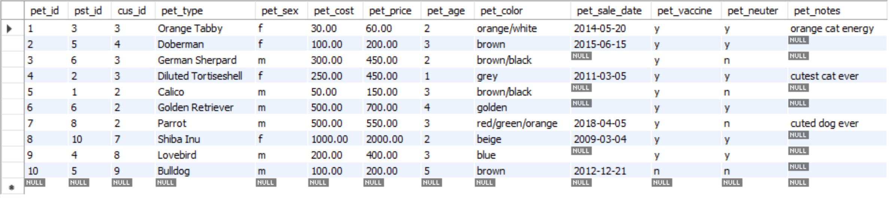
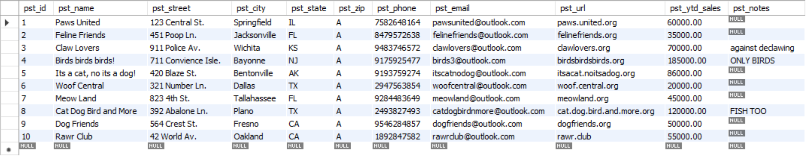
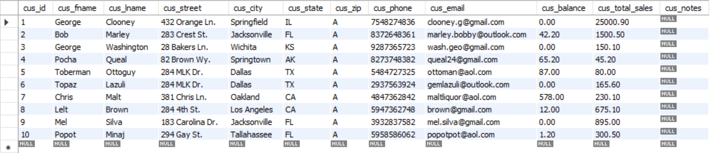
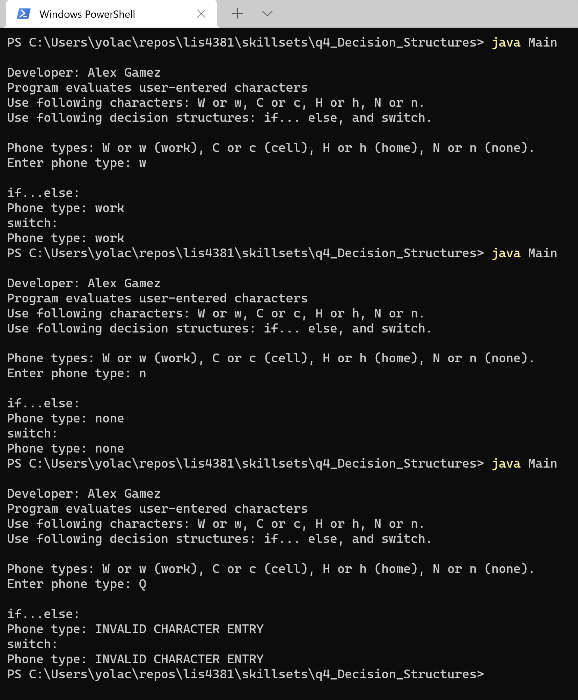
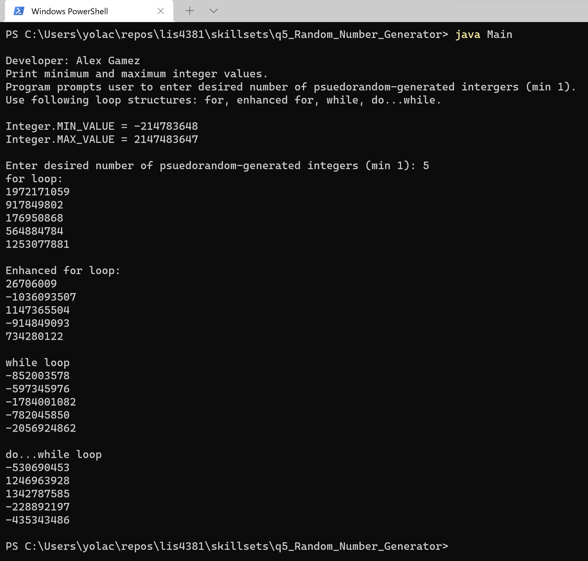
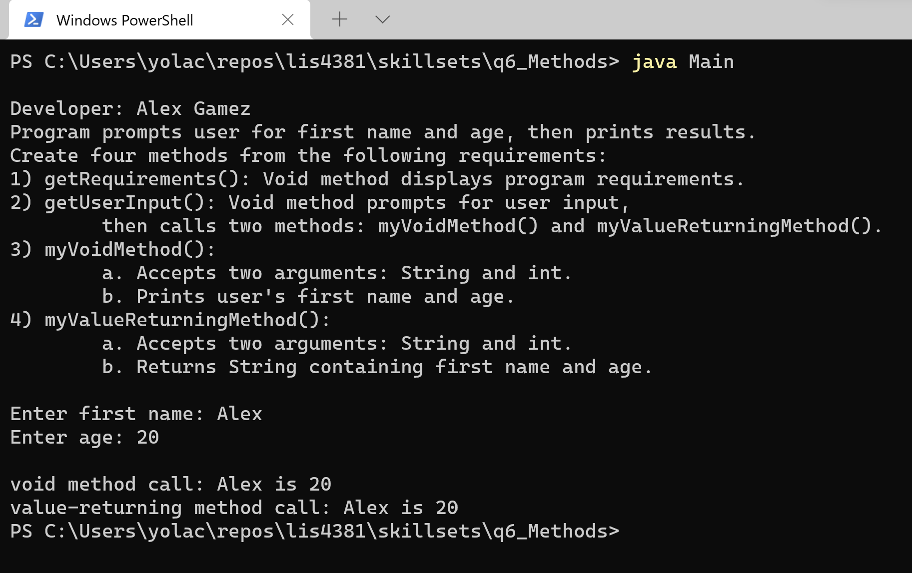

> **NOTE:** This README.md file should be placed at the **root of each of your repos directories.**
>
>Also, this file **must** use Markdown syntax, and provide project documentation as per below--otherwise, points **will** be deducted.
>

# LIS4381 - Mobile Web Application Development

## Alex Gamez

### Assignment 3 Requirements:

*Six Parts*

1. Screenshot of ERD
2. Screenshot of running application's **opening** user interface
3. Screenshot of running application's **processing** user interace
4. Screenshot of 10 records for **each** table -- use "select * from each table"
5. Links to the following files:
	- a3.mwb
	- a3.sql
6. Screenshot of skillsets 4-6

### Assignment Screenshots:

*Screenshot of ERD:*

*Screenshot of running application's opening user interface:*

*Screenshot of processing application's opening user interface:*

| Screenshot of running opening user interface | Screenshot of processing user interface |
| ---------- | ---------- |
|  |  |

*Screenshot of 10 records for each table:*

*Pet table:*

*Petstore table:*

*Customer table:*

### Links

*a3.mwb file:*

[a3.mwb](docs/a3.mwb "a3.mwb file")

*a3.sql file:*

[a3.sql](docs/a3.sql "a3.sql file")

#### Skillset 4-6 Screenshots:

*Screenshot of Skillset 4: Decision Structures:*

*Screenshot of Skillset 5: Random Number Generator:*

*Screenshot of Skillset 6: Methods:*

