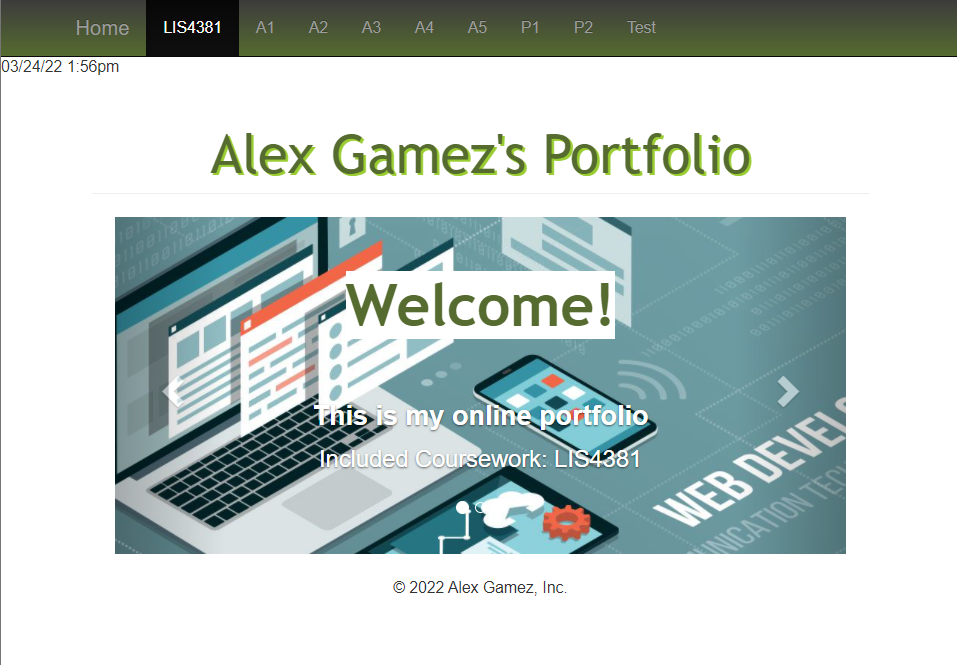
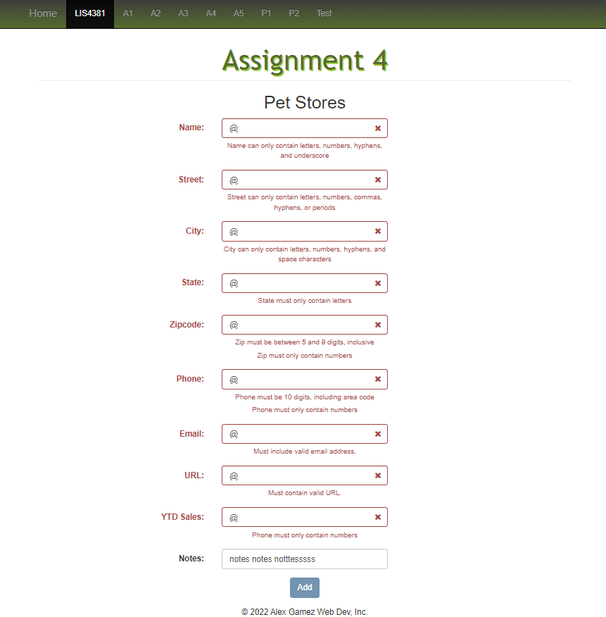
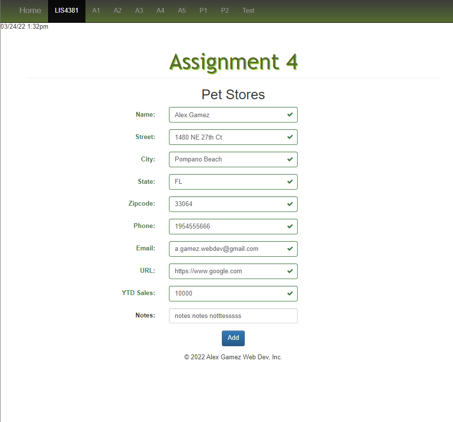

> **NOTE:** This README.md file should be placed at the **root of each of your repos directories.**
>
>Also, this file **must** use Markdown syntax, and provide project documentation as per below--otherwise, points **will** be deducted.
>

# LIS4381 - Mobile Web Application Development

## Alex Gamez

### Assignment 4 Requirements:

*Six Parts*

1. Screenshot of LIS4381 Portal (Main Page)
2. Screenshot of Failed Validation
3. Screenshot of Passed Validation
5. Link to local lis4381 web app: http://localhost/repos/lis4381/
6. Screenshot of skillsets 10-12

### Assignment Screenshots:

*Screenshot of LIS4381 Portal (Main Page):*

| Screenshot of Failed Validation | Screenshot of Passed Validation |
| ---------- | ---------- |
|  |  |

### Links

Local LIS4381 Web App: http://localhost/repos/lis4381/

#### Skillset 4-6 Screenshots:

*Screenshot of Skillset 4: Decision Structures:*

*Screenshot of Skillset 5: Random Number Generator:*

*Screenshot of Skillset 6: Methods:*

