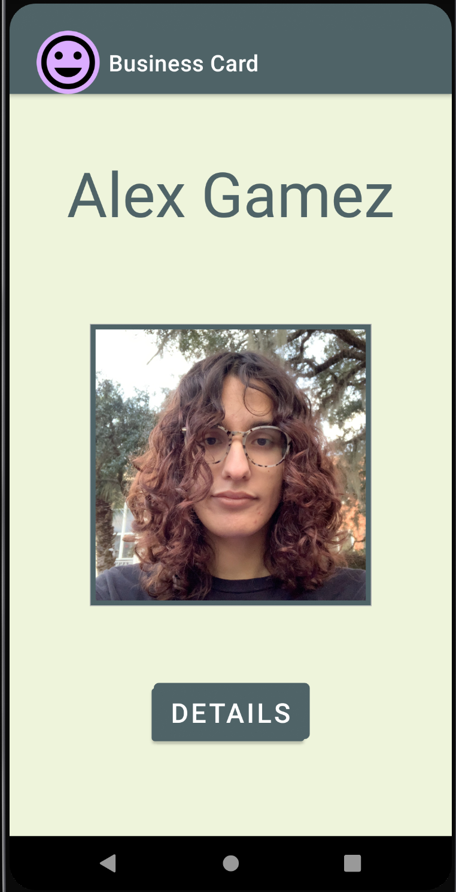
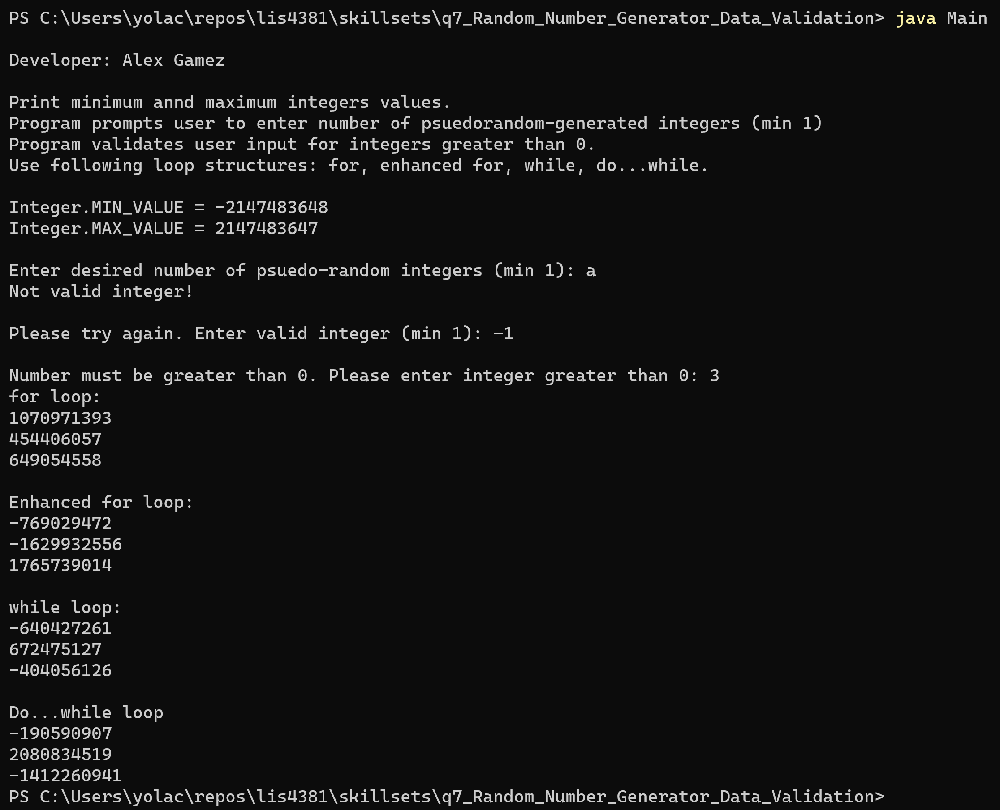
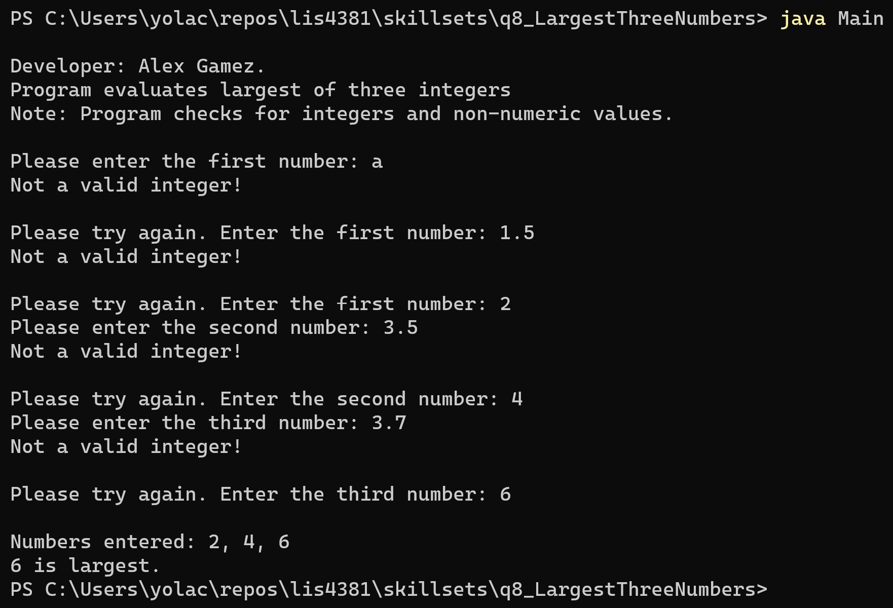
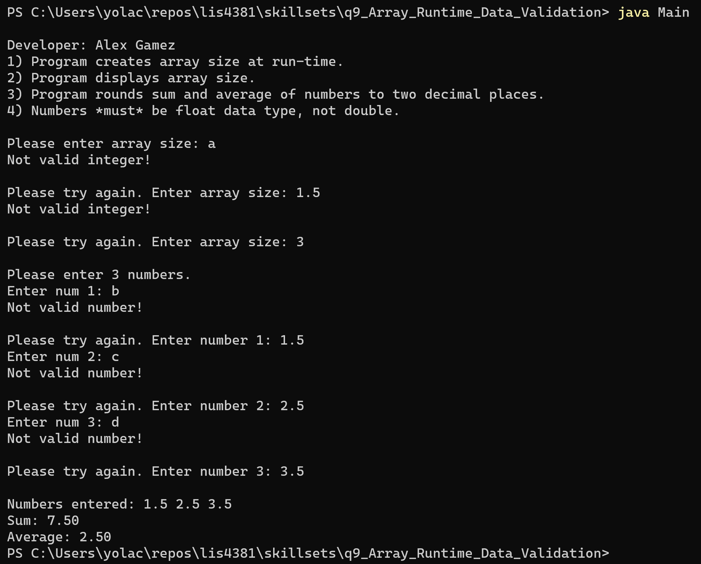

> **NOTE:** This README.md file should be placed at the **root of each of your repos directories.**
>
>Also, this file **must** use Markdown syntax, and provide project documentation as per below--otherwise, points **will** be deducted.
>

# LIS4381 - Mobile Web Application Development

## Alex Gamez

### Project 1 Requirements:

*Five Parts*

1. Screenshot of running application’s first user interface
2. Screenshot of running application’s second user interface
3. Research how to display launcher icon on action bar, change background color, add image border and text shadow to button.
4. Questions (PHP/MySQL: Chs. 7, 8)
5. Screenshot of skillsets 7-9.

## Assignment Screenshots:

| Screenshot of first user interface | Screenshot of second user interface |
| ---------- | ---------- |
|  |  |

## Skillset 7-9 Screenshots:

*Screenshot of Skillset 7: Random Number Generator Data Validation:*

*Screenshot of Skillset 8: Largest Three Numbers:*

*Screenshot of Skillset 9: Array Runtime Data Validation:*

## Bitbucket Repo Links

1. https://bitbucket.org/aeg19h/lis4381/src/master/
2. https://bitbucket.org/aeg19h/lis4381/src/master/p1/

